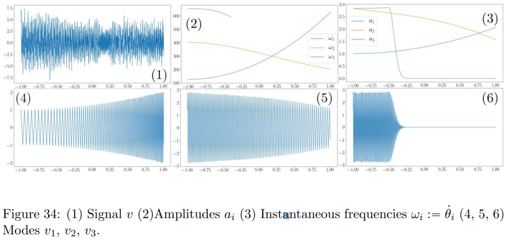
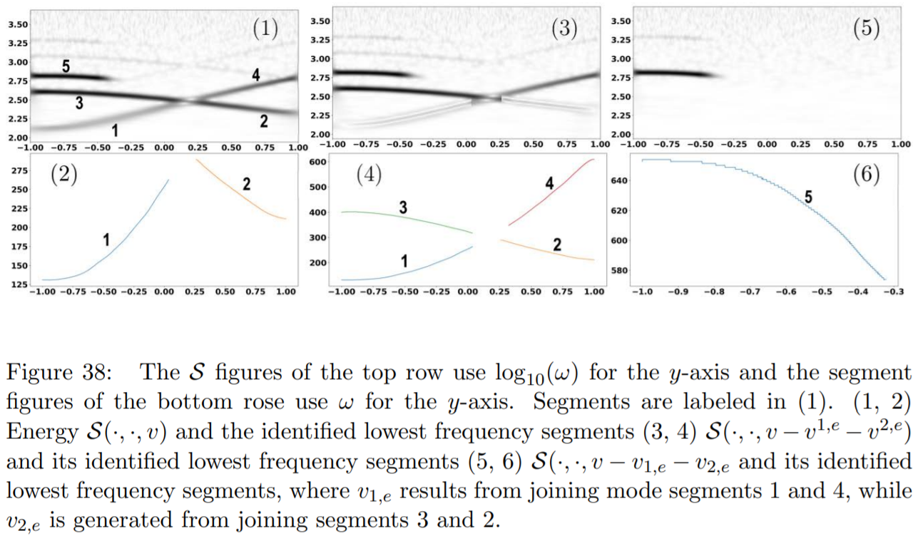

# Kernel Mode Decomposition for 1D signals


This code is an implementation of the mode decomposition algorithm detailed in https://arxiv.org/abs/1907.08592.  Signals which are the sums of noise and a certain number of nearly periodic modes can be seperated into each mode.  By nearly periodic, we mean each mode is of form <a href="https://www.codecogs.com/eqnedit.php?latex=\inline&space;a(t)&space;y(\theta(t))" target="_blank"></a>, where y is some periodic function, called the base waveform, and <a href="https://www.codecogs.com/eqnedit.php?latex=\inline&space;a(t),&space;\theta(t)" target="_blank"></a> are relatively slowly varying on timescales of order <a href="https://www.codecogs.com/eqnedit.php?latex=\inline&space;\frac{1}{\theta'(t)}" target="_blank"></a>.  These nearly periodic modes can be seen in Figure 24.4-6 and their slowly varying amplitudes and frequencies in Figure 24.2-3.  The composite signal that is observed by the algorithm is shown in Figure 24.1 (this example can be found in *tri_wave.py*).  Signals not of this form are outside the scope of this project.

The main idea of this algorithm is to run an iteration where each step idetnfies the lowest non-negligible frequency of the signal at each time t.  Note that in the signal in Figure 24, where the frequencies of modes do not intersect, this algorithm directly identifies a mode at each iteration.  However, whenever modes vanish or have intersecting frequencies, *fragments* of modes could be identified with the algorithm.  This issue is addressed in the next section.  Furthermore, if the base waveform is unknown, the algorithm has built-in functionality to solve for each of the waveforms.

# Intersection of frequencies



Figure 34 illustrates the signal decomposed in *tri_cross_vanish_noise.py*.  Notice that the first and second modes intersect in frequency around t=0.25.  Furthermore, the highest frequency mode vanishes around t=-0.25.  This example adds in the further wrinkle of having noise.  

The three iterations of signal energy (essentially a localized Fourier spectrum) and identified frequencies is shown in Figure 38.  The identified mode fragments are labeled 1 through 5.  In this case, our algorithm at each iteration works by passing fragments of modes that haven't been nearly fully identified (such as fragments 1 and 2 at the first iteration), joining together fragments that comprise full modes (such as 1/4, 2/3, or 5), or removing fragments that correspond to multiple modes (at an intersection) or are artifacts of noise (none of the 5 mode fragments).




# Installation

Anaconda 4.7.12 and Python 3.7 was used to run the project.  All functions are contained in file KMD_lib.py and all other .py files are examples on usage

# Usage

The main decomposition algorithm is implemented in two slightly different ways in the functions *semimanual_maxpool_peel2* and *manual_maxpool_peel2*.  The inputs of both functions are:

**signal**: The signal to be decomposed into modes

**waveform** (optional): The base waveform of the signal.  This should be a two entry list with the first entry being "cos" (cosine), "tri" (triangle wave), "ekg" (synthetic EKG-like wave), "custom" (custom waveform given with Fourier series), or "unk" (unknown waveform).  If first entry is "cos", "tri", or "ekg", the second entry is irrelevant with default value "0".  If it is "custom", set the second entry to be a numpy array, a, of shape (N, 2).  Then the base waveform is of form 

<a href="https://www.codecogs.com/eqnedit.php?latex=\sum_{k}&space;a[k,&space;0]&space;\cos((k&plus;1)&space;t)&space;&plus;&space;a[k,1]&space;\sin((k&space;&plus;&space;1)t)" target="_blank"></a>

The current implementation requires (WLOG) that a[0, 0] = 1 and a[0, 1] = 0.  If the first entry is "unk", set the second entry to be the desired number of overtones the algorithm estimates.

**alpha** (optional): the width of the Gaussian window

**t_mesh** (optional): the time mesh of the signal (must be evenly spaced).

**thresh** (optional): the threshold to stop the opt final loop (\epsilon_1 in Alg 6)

**thresh_en** (optional): the threshold to identify \omega_low as in eq 7.15 (it is a factor of the maximum energy, so 0.05 represents 5% of the max energy)

**ref_fin** (optional): True attempts to refine to near machine precision, False does not attempt only select True if the modes are non-intersecting/vanishing and there is no noise.  Also, this slows the mode decomposition greatly.

The output of this function is:

**fmodes**: An numpy array of shape (number of submodes, signal size, 4) containing the identified modes.  Note that axis 2 = 0 contains amp, 1 contains phase, 2 freq, 3 low and high stops (bounds of support of the signal).

**wp**: A class containing the estimated waveforms.  This is only relevant in the "unk" wave parameter case.  Note that wp.f is a numpy array of shape (num modes, num overtones, 2).

The only difference is that *semimanual_maxpool_peel2* makes an attempt to identify full modes (from the mode segments) and automatically peels them.  If no mode segments are identified as full modes, then the mode segments are passed to the user to either be combined into full modes, passed to the next iteration (if identified mode segments don't approximately span a full mode), or disregarded (if segments are artifacts of noise or a frequency intersection).  The *manual_maxpool_peel2* function will pass all identified mode segments to the user for judgement.

The first prompt in this user input is: 

>Input mode segments to add to mode 0 (if done with mode: Next, if done with all modes: Done):

The proper input those of those mode segments comprising of any full mode.  The user should input *mode segment a* then enter, *mode segment b* then enter, and so on.  When finished inputting these modes, *Next* should be inputted if there are more mode segments to be grouped and *Done* otherwise.  Note that when there are crossing frequencies, it is recommended for modes not to be grouped until after both modes have been fully identified outside of near the intersection (these segments should be all passed to the next iteration).

After this step has been completed, the modes to be passed the next iteration will be entered.  The user will see prompt:

>The following modes remain, select which ones to keep:

The user should then input the segments to pass to the next iteration in the same manner.  When done, input *Done*.

If there are no crossing frequency modes, *semimanual_maxpool_peel2* should not require any user input.

# Examples

*tri_wave.py* and *ekg_wave.py* are implementations of the algorithm on examples with base triangle and synthetic EKG-like waveforms.  Since they have no frequency intersections, they require no user input. 

*wave_learn.py* is an example of learning the waveforms of each mode.

*tri_cross_vanish_noise.py* and *tri_cross_vanish_noise2.py* are examples of triangle wave modes that have crossing frequencies, vanish, and is corrupted with white noise.  The first is the example used in the paper.  The recommended inputs are as follows:

*tri_cross_vanish_noise.py*:

Done, 0, 1, Done ... 0, 3, Next, 1, 2, Done 

Note that the two sequences only identifies the lowest two intersecting frequency modes.  The final mode is identified automatically.

*tri_cross_vanish_noise2.py*:

0, Done, 1, 3, Done ... 0, 4, Next, 1, 2, Done ...

# Usage

```shell
python -m venv .venv
source .venv/bin/activate
pip install -e .
```
